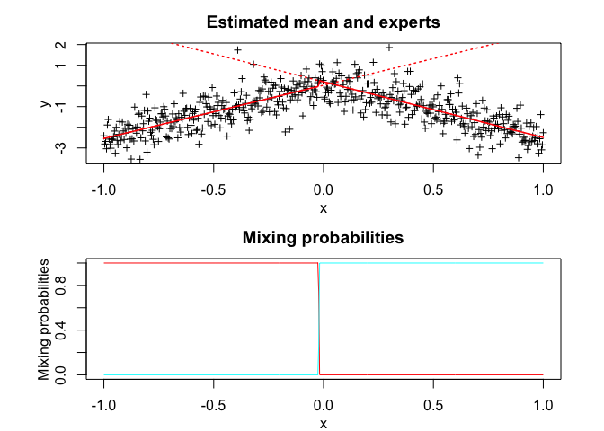
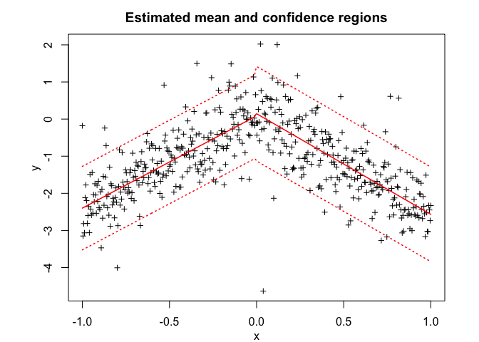
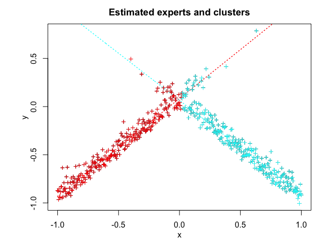
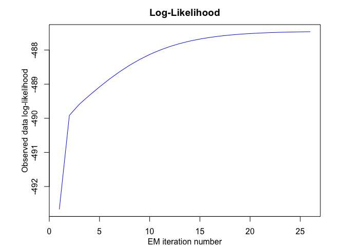
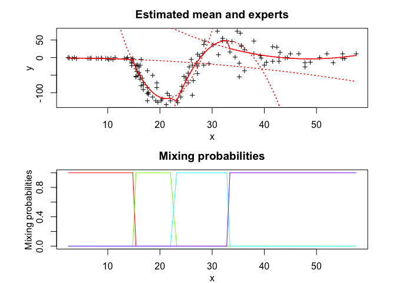
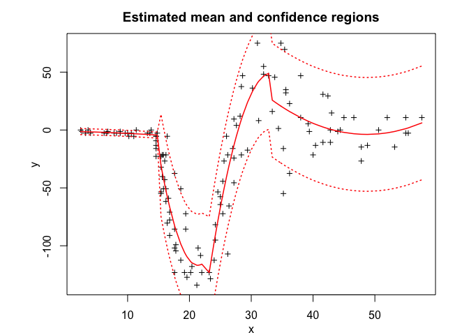
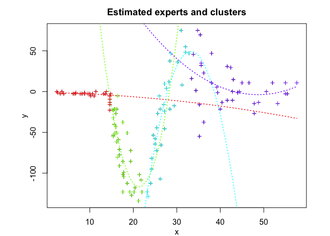
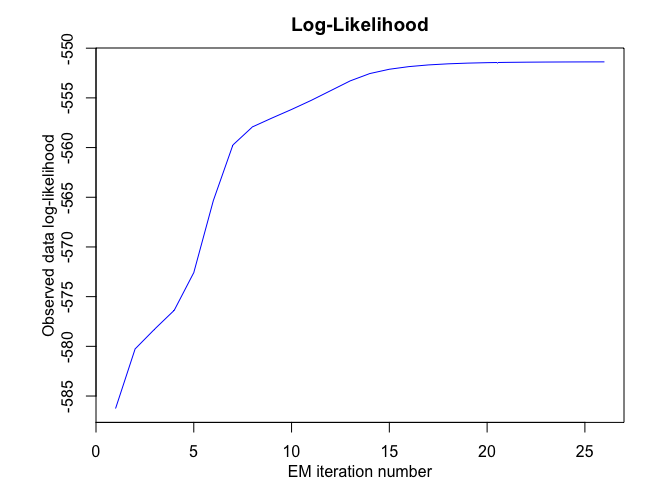

<!-- README.md is generated from README.Rmd. Please edit that file -->

<!-- badges: start -->

<!-- badges: end -->

# Overview

**TMoE** (t Mixture-of-Experts) provides a flexible and robust modelling
framework for heterogenous data with possibly heavy-tailed distributions
and corrupted by atypical observations. **TMoE** consists of a mixture
of *K* t expert regressors network (of degree *p*) gated by a softmax
gating network (of degree *q*) and is represented by:

  - The gating network parameters `alpha`’s of the softmax net.
  - The experts network parameters: The location parameters (regression
    coefficients) `beta`’s, scale parameters `sigma`’s, and the degree
    of freedom (robustness) parameters `nu`’s. **TMoE** thus generalises
    mixtures of (normal, t, and) distributions and mixtures of
    regressions with these distributions. For example, when \(q=0\), we
    retrieve mixtures of (t-, or normal) regressions, and when both
    \(p=0\) and \(q=0\), it is a mixture of (t-, or normal)
    distributions. It also reduces to the standard (normal, t)
    distribution when we only use a single expert (\(K=1\)).

Model estimation/learning is performed by a dedicated expectation
conditional maximization (ECM) algorithm by maximizing the observed data
log-likelihood. We provide simulated examples to illustrate the use of
the model in model-based clustering of heterogeneous regression data and
in fitting non-linear regression functions.

# Installation

You can install the development version of tMoE from
[GitHub](https://github.com/) with:

``` r
# install.packages("devtools")
devtools::install_github("fchamroukhi/tMoE")
```

To build *vignettes* for examples of usage, type the command below
instead:

``` r
# install.packages("devtools")
devtools::install_github("fchamroukhi/tMoE", 
                         build_opts = c("--no-resave-data", "--no-manual"), 
                         build_vignettes = TRUE)
```

Use the following command to display vignettes:

``` r
browseVignettes("tMoE")
```

# Usage

``` r
library(tMoE)
```

``` r
# Application to a simulated data set

n <- 500 # Size of the sample
alphak <- matrix(c(0, 8), ncol = 1) # Parameters of the gating network
betak <- matrix(c(0, -2.5, 0, 2.5), ncol = 2) # Regression coefficients of the experts
sigmak <- c(0.5, 0.5) # Standard deviations of the experts
nuk <- c(5, 7) # Degrees of freedom of the experts network t densities
x <- seq.int(from = -1, to = 1, length.out = n) # Inputs (predictors)

# Generate sample of size n
sample <- sampleUnivTMoE(alphak = alphak, betak = betak, 
                         sigmak = sigmak, nuk = nuk, 
                         x = x)
y <- sample$y

K <- 2 # Number of regressors/experts
p <- 1 # Order of the polynomial regression (regressors/experts)
q <- 1 # Order of the logistic regression (gating network)

tmoe <- emTMoE(X = x, Y = y, K = K, p = p, q = q, verbose = TRUE)
#> EM - tMoE: Iteration: 1 | log-likelihood: -507.928362957919
#> EM - tMoE: Iteration: 2 | log-likelihood: -496.616459751407
#> EM - tMoE: Iteration: 3 | log-likelihood: -495.338057533443
#> EM - tMoE: Iteration: 4 | log-likelihood: -494.87665901798
#> EM - tMoE: Iteration: 5 | log-likelihood: -494.540436405711
#> EM - tMoE: Iteration: 6 | log-likelihood: -494.260884719921
#> EM - tMoE: Iteration: 7 | log-likelihood: -494.028559169549
#> EM - tMoE: Iteration: 8 | log-likelihood: -493.838442870077
#> EM - tMoE: Iteration: 9 | log-likelihood: -493.685148294063
#> EM - tMoE: Iteration: 10 | log-likelihood: -493.563063681606
#> EM - tMoE: Iteration: 11 | log-likelihood: -493.466798391512
#> EM - tMoE: Iteration: 12 | log-likelihood: -493.391472407013
#> EM - tMoE: Iteration: 13 | log-likelihood: -493.332850725223
#> EM - tMoE: Iteration: 14 | log-likelihood: -493.287369975896
#> EM - tMoE: Iteration: 15 | log-likelihood: -493.252100316603
#> EM - tMoE: Iteration: 16 | log-likelihood: -493.22467655087
#> EM - tMoE: Iteration: 17 | log-likelihood: -493.203230250478
#> EM - tMoE: Iteration: 18 | log-likelihood: -493.186308225785
#> EM - tMoE: Iteration: 19 | log-likelihood: -493.172706219166
#> EM - tMoE: Iteration: 20 | log-likelihood: -493.161526034733
#> EM - tMoE: Iteration: 21 | log-likelihood: -493.152172688251
#> EM - tMoE: Iteration: 22 | log-likelihood: -493.144033992847
#> EM - tMoE: Iteration: 23 | log-likelihood: -493.136717342691
#> EM - tMoE: Iteration: 24 | log-likelihood: -493.129943945468
#> EM - tMoE: Iteration: 25 | log-likelihood: -493.123532865153
#> EM - tMoE: Iteration: 26 | log-likelihood: -493.117387797421
#> EM - tMoE: Iteration: 27 | log-likelihood: -493.111482777337
#> EM - tMoE: Iteration: 28 | log-likelihood: -493.105843922753
#> EM - tMoE: Iteration: 29 | log-likelihood: -493.100527041868
#> EM - tMoE: Iteration: 30 | log-likelihood: -493.095594424752
#> EM - tMoE: Iteration: 31 | log-likelihood: -493.091095987998
#> EM - tMoE: Iteration: 32 | log-likelihood: -493.087058604732
#> EM - tMoE: Iteration: 33 | log-likelihood: -493.083484032917
#> EM - tMoE: Iteration: 34 | log-likelihood: -493.080352933777
#> EM - tMoE: Iteration: 35 | log-likelihood: -493.077631561476
#> EM - tMoE: Iteration: 36 | log-likelihood: -493.075278455602
#> EM - tMoE: Iteration: 37 | log-likelihood: -493.07324975642
#> EM - tMoE: Iteration: 38 | log-likelihood: -493.071502796451
#> EM - tMoE: Iteration: 39 | log-likelihood: -493.069998180986
#> EM - tMoE: Iteration: 40 | log-likelihood: -493.068700757997
#> EM - tMoE: Iteration: 41 | log-likelihood: -493.067579865647
#> EM - tMoE: Iteration: 42 | log-likelihood: -493.066609158996
#> EM - tMoE: Iteration: 43 | log-likelihood: -493.065766222905
#> EM - tMoE: Iteration: 44 | log-likelihood: -493.065032101059
#> EM - tMoE: Iteration: 45 | log-likelihood: -493.064390816246
#> EM - tMoE: Iteration: 46 | log-likelihood: -493.063828921376
#> EM - tMoE: Iteration: 47 | log-likelihood: -493.063335098862
#> EM - tMoE: Iteration: 48 | log-likelihood: -493.062899813509

tmoe$summary()
#> -------------------------------------
#> Fitted t Mixture-of-Experts model
#> -------------------------------------
#> 
#> tMoE model with K = 2 experts:
#> 
#>  log-likelihood df       AIC       BIC      ICL
#>       -493.0629 10 -503.0629 -524.1359 -525.154
#> 
#> Clustering table (Number of observations in each expert):
#> 
#>   1   2 
#> 249 251 
#> 
#> Regression coefficients:
#> 
#>     Beta(k = 1) Beta(k = 2)
#> 1    0.08674103   0.1446643
#> X^1  2.48588510  -2.7119949
#> 
#> Variances:
#> 
#>  Sigma2(k = 1) Sigma2(k = 2)
#>      0.2531752     0.3249455

tmoe$plot()
```



``` r
# Application to a real data set

library(MASS)
data("mcycle")
x <- mcycle$times
y <- mcycle$accel

K <- 4 # Number of regressors/experts
p <- 2 # Order of the polynomial regression (regressors/experts)
q <- 1 # Order of the logistic regression (gating network)

tmoe <- emTMoE(X = x, Y = y, K = K, p = p, q = q, verbose = TRUE)
#> EM - tMoE: Iteration: 1 | log-likelihood: -584.244551006939
#> EM - tMoE: Iteration: 2 | log-likelihood: -583.280585053327
#> EM - tMoE: Iteration: 3 | log-likelihood: -582.557277699991
#> EM - tMoE: Iteration: 4 | log-likelihood: -579.684600371645
#> EM - tMoE: Iteration: 5 | log-likelihood: -570.615713035833
#> EM - tMoE: Iteration: 6 | log-likelihood: -563.236929636529
#> EM - tMoE: Iteration: 7 | log-likelihood: -560.272130663352
#> EM - tMoE: Iteration: 8 | log-likelihood: -559.560569040992
#> EM - tMoE: Iteration: 9 | log-likelihood: -558.966547963314
#> EM - tMoE: Iteration: 10 | log-likelihood: -558.220009630403
#> EM - tMoE: Iteration: 11 | log-likelihood: -557.308586076979
#> EM - tMoE: Iteration: 12 | log-likelihood: -556.278615089687
#> EM - tMoE: Iteration: 13 | log-likelihood: -555.284312317758
#> EM - tMoE: Iteration: 14 | log-likelihood: -554.422594896656
#> EM - tMoE: Iteration: 15 | log-likelihood: -553.660145240677
#> EM - tMoE: Iteration: 16 | log-likelihood: -552.986725110468
#> EM - tMoE: Iteration: 17 | log-likelihood: -552.426713217875
#> EM - tMoE: Iteration: 18 | log-likelihood: -551.997394824966
#> EM - tMoE: Iteration: 19 | log-likelihood: -551.691558063471
#> EM - tMoE: Iteration: 20 | log-likelihood: -551.484716815219
#> EM - tMoE: Iteration: 21 | log-likelihood: -551.348917434038
#> EM - tMoE: Iteration: 22 | log-likelihood: -551.260966054648
#> EM - tMoE: Iteration: 23 | log-likelihood: -551.204198326394
#> EM - tMoE: Iteration: 24 | log-likelihood: -551.167472304675
#> EM - tMoE: Iteration: 25 | log-likelihood: -551.143566186338
#> EM - tMoE: Iteration: 26 | log-likelihood: -551.127872679481
#> EM - tMoE: Iteration: 27 | log-likelihood: -551.117463890004
#> EM - tMoE: Iteration: 28 | log-likelihood: -551.110476692798
#> EM - tMoE: Iteration: 29 | log-likelihood: -551.105720811558
#> EM - tMoE: Iteration: 30 | log-likelihood: -551.102431819953
#> EM - tMoE: Iteration: 31 | log-likelihood: -551.10011588253
#> EM - tMoE: Iteration: 32 | log-likelihood: -551.098451963309
#> EM - tMoE: Iteration: 33 | log-likelihood: -551.097229969444
#> EM - tMoE: Iteration: 34 | log-likelihood: -551.096311424809
#> EM - tMoE: Iteration: 35 | log-likelihood: -551.09560433537
#> EM - tMoE: Iteration: 36 | log-likelihood: -551.095047042671
#> EM - tMoE: Iteration: 37 | log-likelihood: -551.094597800858

tmoe$summary()
#> -------------------------------------
#> Fitted t Mixture-of-Experts model
#> -------------------------------------
#> 
#> tMoE model with K = 4 experts:
#> 
#>  log-likelihood df       AIC       BIC       ICL
#>       -551.0946 26 -577.0946 -614.6691 -614.6651
#> 
#> Clustering table (Number of observations in each expert):
#> 
#>  1  2  3  4 
#> 28 37 31 37 
#> 
#> Regression coefficients:
#> 
#>      Beta(k = 1) Beta(k = 2)  Beta(k = 3) Beta(k = 4)
#> 1   -1.036774138  995.335183 -1838.394608 295.2131862
#> X^1 -0.112211948 -104.221689   113.547570 -12.2742814
#> X^2 -0.007645766    2.441534    -1.707552   0.1259613
#> 
#> Variances:
#> 
#>  Sigma2(k = 1) Sigma2(k = 2) Sigma2(k = 3) Sigma2(k = 4)
#>       1.583492      450.3015      538.2972      557.4782

tmoe$plot()
```


